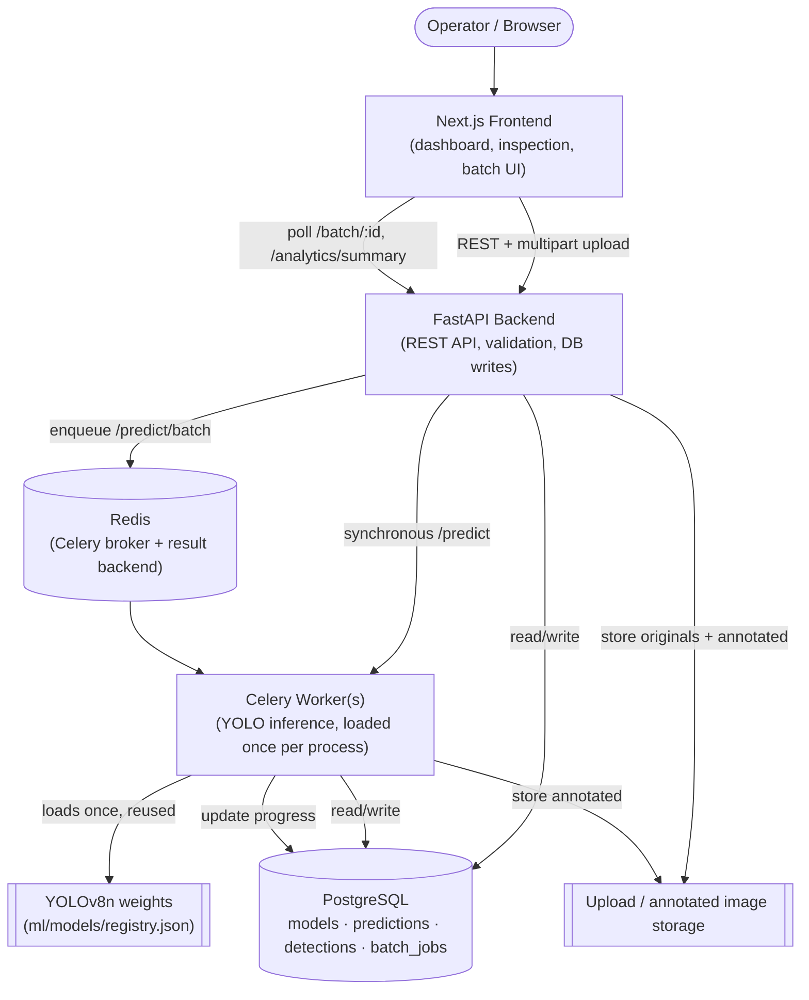
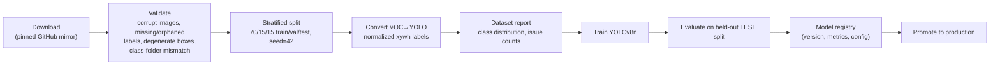
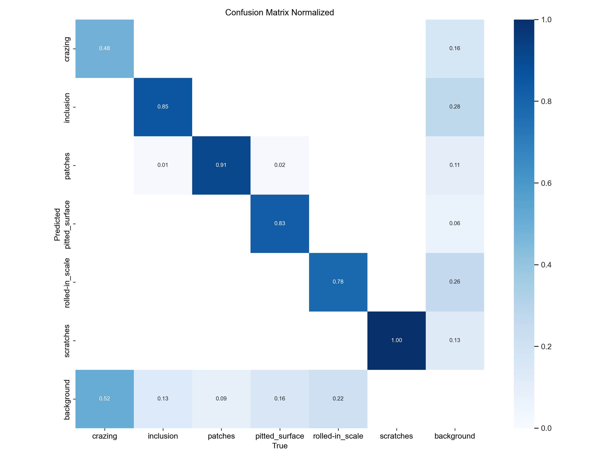
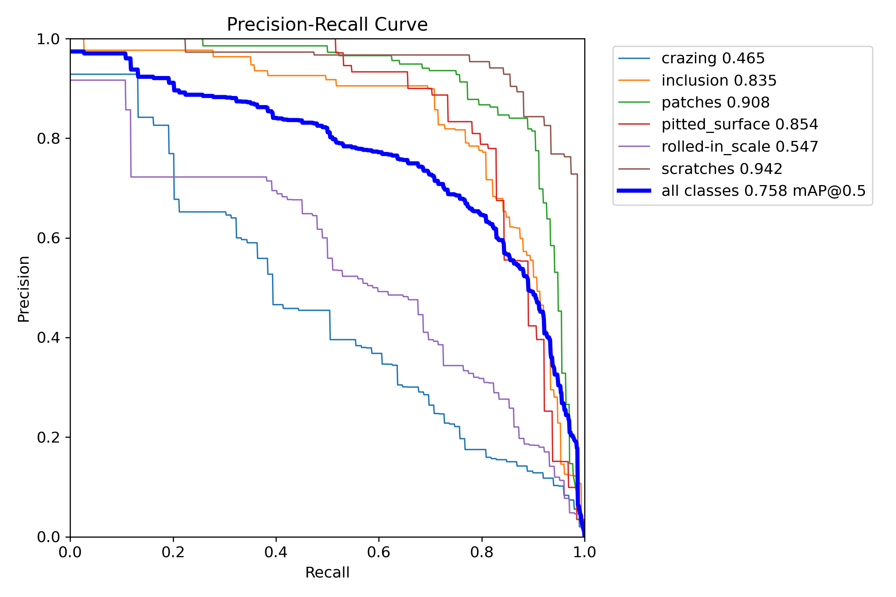
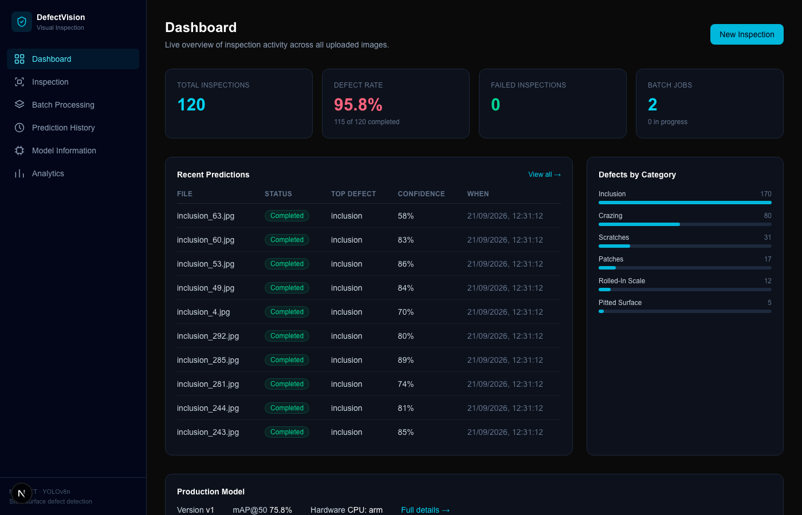
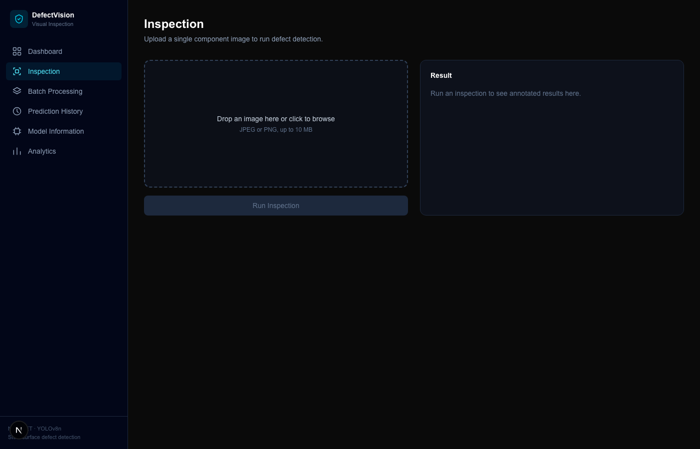
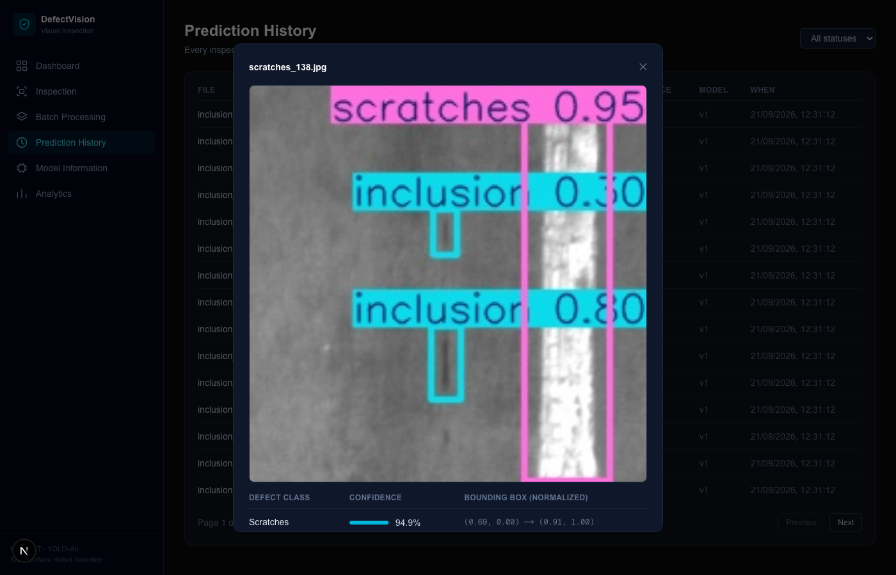
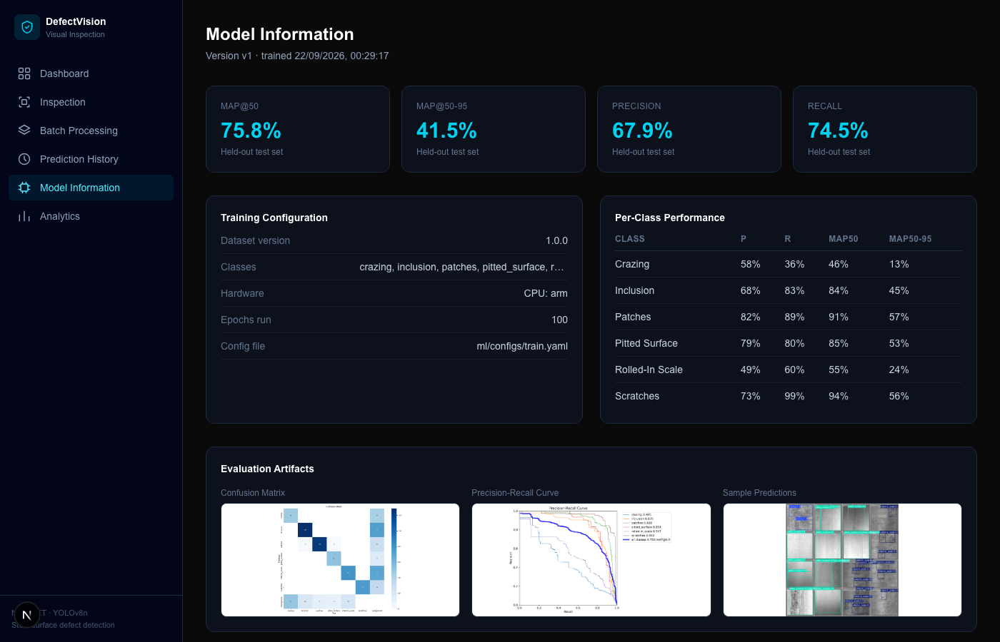
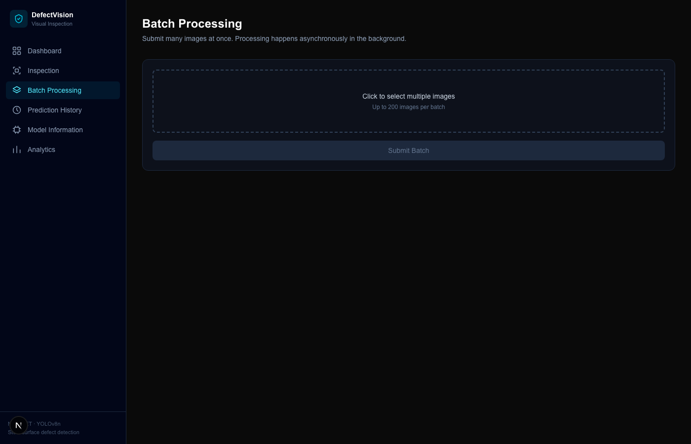
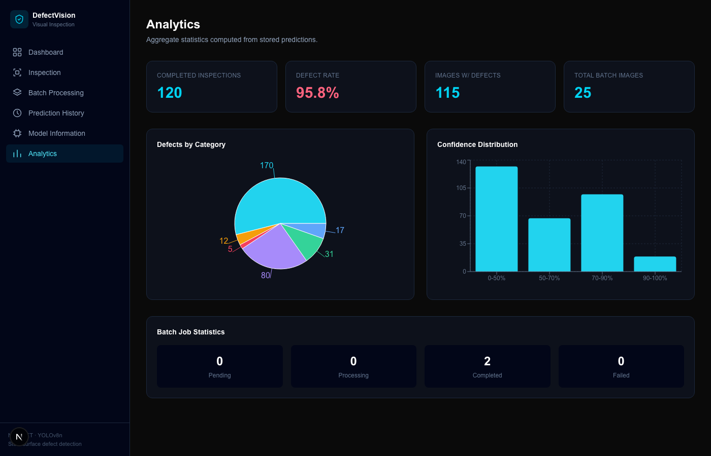

# DefectVision — AI-Powered Industrial Visual Inspection System

An end-to-end computer vision system that detects and localizes surface defects on
hot-rolled steel strip images: dataset pipeline, a fine-tuned YOLOv8 detector, an
asynchronous FastAPI inference service, and a Next.js dashboard — all containerized
and backed by Postgres/Redis/Celery.

This is a personal portfolio project built end-to-end (dataset selection through
deployment), not a wrapper around a pretrained model. Every metric quoted below was
produced by actually running the scripts in this repo on the hardware described in
[Performance](#performance) — nothing is estimated or assumed.

## Table of Contents

1. [Problem](#problem)
2. [Solution](#solution)
3. [Dataset](#dataset)
4. [Dataset License](#dataset-license)
5. [Architecture](#architecture)
6. [Model](#model)
7. [Training](#training)
8. [Evaluation](#evaluation)
9. [Performance](#performance)
10. [API](#api)
11. [Batch Inference](#batch-inference)
12. [Deployment](#deployment)
13. [Docker](#docker)
14. [Testing](#testing)
15. [Screenshots](#screenshots)
16. [Limitations](#limitations)
17. [Future Improvements](#future-improvements)

---

## Problem

Manual visual inspection of manufactured components — steel strip, in this case — is
slow, inconsistent between inspectors, and doesn't scale with production throughput.
Small surface defects (hairline cracks, inclusions, rolled-in scale) are easy to miss
under time pressure and cause downstream quality failures.

## Solution

DefectVision automates the inspection step: an operator (or an upstream camera system)
uploads an image, and within tens of milliseconds gets back the defect class,
confidence, and bounding box, plus an annotated image. It supports two workflows:

- **Single image** — synchronous, for spot-checks and interactive use.
- **Batch** — asynchronous, for processing hundreds of images from a shift without
  blocking on the HTTP request; a Celery worker pool consumes a Redis queue and the
  client polls for progress.

Every prediction, detection, and batch job is persisted to Postgres, which drives a
live analytics dashboard (defect rate, per-category breakdown, confidence
distribution) — no part of the dashboard is populated with fabricated data; an empty
database renders an explicit empty state.

## Dataset

**[NEU-DET](http://faculty.neu.edu.cn/songkc/en/zdylm/263265)** (Northeastern
University Surface Defect Database — detection variant), created by Kechen Song and
Yunhui Yan.

**Why this dataset:**

- It's a genuine **object detection** task (Pascal VOC XML bounding-box annotations),
  not classification-only, which is what the brief asks for and what makes YOLO the
  right architecture.
- Six visually distinct, well-documented defect classes on a single material
  (hot-rolled steel strip), so the label semantics are unambiguous — no per-class
  labeling guesswork.
- Small and fast to iterate on (1,800 images, 200×200 px) — appropriate for a project
  meant to be trained on a single CPU/Apple-Silicon machine, not a multi-GPU cluster,
  in the "start with an appropriately sized model" spirit of the brief.
- It is the most widely cited public dataset for this exact task (used in dozens of
  peer-reviewed steel-defect-detection papers), which makes published numbers a
  useful sanity check against this repo's own results.

**Task:** object detection (6 classes, single object type per image region).

**Classes:** `crazing`, `inclusion`, `patches`, `pitted_surface`, `rolled-in_scale`,
`scratches` — 300 images per class, 1,800 total, each with 1–9 bounding boxes
(mean 2.33 boxes/image measured directly from this repo's validated data — see
[ml/data/reports/dataset_report.md](ml/data/reports/dataset_report.md)).

**Labels:** each image has one or more axis-aligned bounding boxes, each tagged with
one of the six class names above. The defect class is implied by the source folder
name in the original release and cross-checked against the XML annotation's own
`<name>` tag during validation (a mismatch is flagged, not silently trusted).

### Dataset License

The original NEU-DET release has **no formal open-source license** — Song & Yan's
lab page and the associated papers ask only that users cite the dataset; they do not
grant (or explicitly withhold) redistribution/commercial rights. Every public mirror
of this dataset (Kaggle included) lists its license as "Unknown" for the same reason.
This is documented here rather than glossed over: **use of NEU-DET in this repository
is for non-commercial, educational/portfolio purposes**, consistent with how it is
used throughout the academic literature. If you plan to use it commercially, contact
the original authors.

Given no official redistribution channel exists that doesn't require a Kaggle/Google
Drive login, this repo's [ml/scripts/download.py](ml/src/defectvision/data/download.py)
pulls the raw images + VOC annotations from a public GitHub mirror
([dbh92/NEU_DET](https://github.com/dbh92/NEU_DET)), pinned to a specific commit SHA
so re-downloads are byte-identical. See `ml/configs/dataset.yaml` for the pinned
commit. If that mirror ever disappears, the same files can be sourced manually from
the official homepage above or any of the Kaggle mirrors and dropped into
`ml/data/raw/NEU-DET/` in the same `{train,validation}/{images,annotations}` layout.

## Architecture



### Data pipeline



Run it yourself:

```bash
python ml/scripts/prepare_data.py   # download -> validate -> split -> convert -> report
python ml/scripts/train.py          # train, register the run (val metrics only)
python ml/scripts/evaluate.py       # evaluate on TEST split, write metrics + plots
python ml/scripts/promote_model.py v1   # mark a version as the production model
```

Every step is config-driven (`ml/configs/dataset.yaml`, `ml/configs/train.yaml`) —
no hyperparameters or paths are hardcoded in the scripts themselves.

## Model

- **Architecture:** YOLOv8n (nano) — the smallest Ultralytics YOLOv8 variant
  (~3.2M parameters), fine-tuned from COCO-pretrained weights.
- **Why nano, not a larger backbone:** NEU-DET has ~1,260 training images across 6
  classes at 200×200 native resolution. A larger backbone (s/m/l/x) adds capacity
  this dataset can't productively use and would overfit faster, while costing
  meaningfully more to train and serve on CPU/Apple-Silicon-only hardware (see
  [Performance](#performance) — there is no CUDA GPU in this setup).
- **Input size:** 320×320 (native images are 200×200; 320 avoids the heavy
  upsampling that YOLO's 640 default would otherwise apply for no real resolution
  gain).
- **Optimizer:** SGD, `lr0=0.01`, cosine schedule to `lr0 * 0.01`, momentum 0.937,
  weight decay 5e-4, 3-epoch warmup.
- **Augmentation:** mosaic, small-angle rotation (±5°), translate/scale jitter,
  horizontal *and* vertical flip (steel strip images have no canonical "up", unlike
  natural photos), reduced HSV-saturation jitter (source images are grayscale).
  Full list in [ml/configs/train.yaml](ml/configs/train.yaml).
- **Batch size:** 16. **Epochs:** configured for up to 100 with early stopping
  (`patience=30` on validation mAP50-95) — see [Training](#training) for what
  actually ran.
- **Hardware:** Apple M4 (8-core GPU) via PyTorch's Metal Performance Shaders (MPS)
  backend. **No CUDA GPU was available for this project** — that's stated plainly
  rather than assumed away; see [Performance](#performance).

Every training parameter above lives in [ml/configs/train.yaml](ml/configs/train.yaml),
not hardcoded in `ml/scripts/train.py`.

## Training

```bash
python ml/scripts/train.py                                   # fresh run
python ml/scripts/train.py --resume path/to/last.pt --device cpu  # resume an interrupted run
```

**What actually happened, documented rather than smoothed over:** the first training
attempt ran on the Apple M4's GPU via PyTorch's MPS backend and trained cleanly for
43 epochs (~4.3 hours) — but MPS-reported memory climbed steadily across those
epochs (from ~1.3 GB early on to over 10 GB by epoch 41), and on this 16 GB
development machine, already running several other unrelated background services,
the process was silently killed mid-epoch-44-validation with no Python exception
(consistent with the OS terminating it under memory pressure — nothing in the
Ultralytics/PyTorch logs pointed to a code-level bug).

Rather than restart from scratch, `ml/scripts/train.py --resume` uses Ultralytics'
built-in checkpoint resume (same run directory, epoch counter, optimizer state, and
LR schedule) to continue from `last.pt` — this time on **CPU**, which sidesteps the
MPS memory-growth pattern entirely (confirmed stable at ~1.3 GB resident memory
during the resumed run, vs. the unbounded growth on MPS). This is exactly the kind
of hardware-constraint problem-solving a single-machine training setup should be
expected to surface, so it's documented here instead of quietly retried until it
disappeared from the record.

**Final training summary** (`v1` in `ml/models/registry.json`):

| | |
|---|---|
| Epochs completed | 100 (43 on MPS, 57 resumed on CPU) |
| Wall-clock time | ~7.7 hours (resumed portion) + ~4.3 hours (initial MPS portion) ≈ 12 hours total, across an interruption |
| Final validation mAP@50 | 0.713 |
| Final validation mAP@50-95 | 0.403 |
| Final validation precision / recall | 0.682 / 0.673 |

Validation metrics are from the split used for early stopping / model selection.
See [Evaluation](#evaluation) below for the honest number: performance on the
held-out TEST split, which the training process never saw in any form.

## Evaluation

Run: `python ml/scripts/evaluate.py --version v1`. Full report with per-class
metrics, confusion matrix, PR/F1/P/R curves, and sample predictions:
[ml/data/reports/evaluation/evaluation_report.md](ml/data/reports/evaluation/evaluation_report.md).

**On the held-out TEST split** (270 images, 628 boxes, never used for training or
for validation-based model selection):

| Metric | Value |
|---|---|
| mAP@50 | **0.758** |
| mAP@50-95 | **0.415** |
| Precision | 0.679 |
| Recall | 0.745 |

**Per-class** (this is where the real story is - performance is not uniform):

| Class | Precision | Recall | mAP@50 | mAP@50-95 |
|---|---|---|---|---|
| patches | 0.818 | 0.894 | 0.908 | 0.572 |
| scratches | 0.725 | 0.987 | 0.942 | 0.556 |
| pitted_surface | 0.785 | 0.799 | 0.854 | 0.535 |
| inclusion | 0.676 | 0.828 | 0.835 | 0.446 |
| rolled-in_scale | 0.492 | 0.598 | 0.547 | 0.245 |
| crazing | 0.576 | 0.364 | 0.465 | 0.135 |

`crazing` and `rolled-in_scale` are visibly the hardest classes - both are
low-contrast, fine-grained textures (hairline cracks; embedded scale patterns)
that are also confusable with each other and with background texture, which
matches what NEU-DET papers report as the two hardest classes in this dataset.
The confusion matrix confirms this concretely: `crazing`'s biggest error mode is
being missed entirely (predicted as background) 52% of the time, not confused
with another defect class.





## Performance

**No CUDA GPU was available for this project.** Every number below was measured
on one machine: a MacBook with an Apple M4 (8-core GPU), comparing PyTorch's CPU
backend against its Metal/MPS backend. Nothing here is estimated.

Single-image end-to-end latency through the real `/predict` endpoint (model
already loaded, warm - first request after startup excluded), 37 requests per
device, measured back-to-back on the same machine right after training finished:

| Device | Mean | Median | P95 | Min | Max |
|---|---|---|---|---|---|
| **CPU** | 21.1 ms | 20.1 ms | 30.3 ms | 13.8 ms | 42.8 ms |
| **MPS (Apple GPU)** | 46.7 ms | 55.1 ms | 71.3 ms | 20.9 ms | 71.7 ms |

**The counterintuitive result: CPU was faster than the GPU for this model.**
YOLOv8n is a 3M-parameter network running on a 320×320 image - fast enough that
MPS's per-call kernel-dispatch and synchronization overhead outweighs whatever
parallelism the GPU offers. This is a real, measured finding specific to this
combination of (tiny model, small input, Apple Silicon MPS backend), not a
general "CPU beats GPU" claim - a larger backbone (YOLOv8s/m/l), a bigger batch,
or an actual CUDA GPU would likely flip this result. Because of this measurement,
`INFERENCE_DEVICE=cpu` is the default in `backend/app/core/config.py`; override
it if you deploy on hardware where GPU wins.

Ultralytics' own batched-validation benchmark (different from the single-request
API path above - this measures raw model throughput without the FastAPI/DB
layer, batch size 16) tells a more nuanced story during `ml/scripts/evaluate.py`:

| Device | Preprocess | Inference | Postprocess (NMS) | Total/image |
|---|---|---|---|---|
| MPS | 2.0 ms | **7.3 ms** | 49.4 ms | 58.7 ms |
| CPU | 0.3 ms | 91.5 ms | **0.8 ms** | 92.6 ms |

Here MPS's raw forward pass is ~12x faster than CPU's, but its NMS/postprocess
step is ~60x slower than CPU's (likely GPU↔CPU tensor transfer overhead for the
NMS step, which Ultralytics runs partly on CPU regardless of device) - and that
postprocess cost dominates enough that MPS still wins on total batched
throughput, the *opposite* ranking from the single-request API latency table
above. Both directions are reported rather than picking whichever makes a
cleaner headline: batched throughput and single-request serving latency are
genuinely different workloads, dominated by different parts of the pipeline.

## Model Versioning

Every training run writes an entry to `ml/models/registry.json` with:

- `version` (auto-incrementing, e.g. `v1`)
- `created_at` (training timestamp)
- `dataset_version` (from `ml/configs/dataset.yaml`)
- `config` (which training config + how many epochs actually ran + class list)
- `val_metrics` (from the validation split, used for early stopping/model selection)
- `test_metrics` (from `ml/scripts/evaluate.py`, on the held-out TEST split — `null`
  until evaluation has been run for that version)
- `is_production` (exactly one entry may be `true`)

`ml/scripts/promote_model.py <version>` is the only thing that flips
`is_production` — a training run never automatically becomes what the API serves,
so a regression can't silently reach `/predict`. The FastAPI backend mirrors this
file into a `model_versions` Postgres table on startup (`app/db/sync_registry.py`)
and serves whichever row has `is_production = true` from `GET /model`.

## API

Base URL: `http://localhost:8000` (see [Deployment](#deployment)). Interactive docs
at `/docs` (Swagger UI, auto-generated by FastAPI from the Pydantic schemas below).

| Method | Path | Description |
|---|---|---|
| `GET` | `/health` | Liveness + dependency check (DB, Redis, model loaded) |
| `GET` | `/model` | Production model version, metrics, training config |
| `POST` | `/predict` | Single-image inference (multipart upload), synchronous |
| `POST` | `/predict/batch` | Submit up to 200 images for async processing |
| `GET` | `/batch/{batch_id}` | Batch job progress/status |
| `GET` | `/predictions/{id}` | One prediction + its detections |
| `GET` | `/predictions` | Paginated prediction history (filter by status/batch) |
| `GET` | `/analytics/summary` | Live dashboard aggregates |

`POST /predict` response:

```json
{
  "id": "8697502e-364d-4b30-8969-736d700f2077",
  "status": "completed",
  "original_filename": "scratches_231.jpg",
  "annotated_image_url": "/static/annotated/408110aa..._annotated.jpg",
  "inference_time_ms": 17.03,
  "model_version": "v1",
  "created_at": "2026-09-21T12:31:12.986978+05:30",
  "detections": [
    { "id": "...", "class_name": "scratches", "confidence": 0.87,
      "x_min": 0.12, "y_min": 0.08, "x_max": 0.91, "y_max": 0.76 }
  ]
}
```

Bounding boxes are normalized `[0, 1]` (matching YOLO's own convention), so the
frontend doesn't need to know the original image resolution to render them.

## Batch Inference

```
POST /predict/batch  (multipart, "files" field, up to 200 images)
  -> 202 { "batch_id": "...", "total_images": N, "status": "processing" }

GET /batch/{batch_id}
  -> { "status": "processing" | "completed" | "failed",
       "total_images": N, "completed_images": n, "failed_images": f }
```

The HTTP request returns as soon as every uploaded file has been validated, saved,
and given its own `Prediction` row — it never waits on inference. Each image becomes
one Celery task (`app.workers.tasks.process_prediction`), so a single bad image
fails independently without blocking the rest of the batch; the batch job's
`completed_images`/`failed_images` counters are updated atomically per task, and the
job flips to `completed` once every image has been attempted (`failed` only if
*every* image in the batch failed). The frontend's Batch Processing page polls
`GET /batch/{id}` every 1.5s and offers a CSV export once it finishes.

## Deployment

```bash
git clone <this repo>
cd DefectVision
cp backend/.env.example backend/.env
cp frontend/.env.local.example frontend/.env.local
docker compose up --build
```

- Frontend: http://localhost:3100
- API: http://localhost:8000 (docs at `/docs`)

The API container runs `alembic upgrade head` before starting uvicorn, so a fresh
Postgres volume gets its schema automatically. The model weights and
`ml/models/registry.json` are mounted read-only from the host — training happens
outside the container (see [Training](#training)), and the API/worker containers
just load whatever's currently marked as production.

### Local (non-Docker) development

```bash
# ML / backend
python -m venv .venv && source .venv/bin/activate
pip install -r requirements/backend.txt

# Postgres + Redis (Homebrew example)
brew services start postgresql@16
redis-server --daemonize yes

createuser defectvision --pwprompt   # password: defectvision
createdb defectvision -O defectvision
createdb defectvision_test -O defectvision

cd backend
alembic upgrade head
uvicorn app.main:app --reload

# separate terminal: worker
celery -A app.workers.celery_app worker --loglevel=info

# separate terminal: frontend
cd frontend && npm install && npm run dev
```

> If you already run other Celery projects locally, they may share Redis's default
> DB 0 and queue name and steal each other's tasks. Point `REDIS_URL` /
> `CELERY_BROKER_URL` at a different DB index (e.g. `redis://localhost:6379/8`) to
> isolate them — this is exactly the collision Docker Compose's per-project Redis
> container avoids.

## Docker

| Image | Dockerfile | Purpose |
|---|---|---|
| `api` | `infra/docker/backend.Dockerfile` | FastAPI app (uvicorn) |
| `worker` | `infra/docker/backend.Dockerfile` (same image, different `command:`) | Celery worker |
| `frontend` | `infra/docker/frontend.Dockerfile` | Next.js standalone production server |
| `postgres` | `postgres:16-alpine` (official) | Database |
| `redis` | `redis:7-alpine` (official) | Celery broker + result backend |

The backend/worker share one image (identical dependencies — both need the full
torch/ultralytics stack to load the model) to avoid two Dockerfiles drifting apart.
The YOLO model is loaded once per process at startup (`app/services/inference.py`'s
module-level singleton, populated in FastAPI's `lifespan` and again once per Celery
worker process) — never reloaded per request. The frontend image uses Next.js's
`output: "standalone"` build so the final image ships only the traced server, not
the full `node_modules` tree.

Docker images are built and validated in CI (see `.github/workflows/ci.yml`) on
every push; **local Docker builds were not run on this development machine** (no
Docker Desktop / container runtime installed here) — see [Limitations](#limitations).

## Testing

```bash
# ML data pipeline (fast, synthetic fixtures - no network or GPU needed)
python -m pytest ml/tests/ -v

# Backend (needs a running Postgres - see Local development above)
cd backend && python -m pytest tests/ -v
```

**38 tests, all passing:** 9 in `ml/tests/` (dataset validation, stratified
splitting, VOC→YOLO conversion) and 29 in `backend/tests/` (upload validation,
every API endpoint, prediction/batch DB lifecycle, model-registry sync).

Coverage by area:

| Area | File | What it checks |
|---|---|---|
| Dataset validation | `ml/tests/test_validate.py` | Every issue type (corrupt image, missing/orphaned label, degenerate/out-of-bounds bbox, folder/class mismatch) is actually flagged, and clean data isn't |
| Dataset split | `ml/tests/test_split.py` | Per-class stratification, determinism given a seed, no train/val/test overlap |
| VOC→YOLO conversion | `ml/tests/test_convert.py` | Normalized bbox math is exactly correct, not just "produces a file" |
| Upload validation | `backend/tests/test_storage.py` | Content-type spoofing, wrong extension, non-image bytes behind a `.jpg` name, oversized files, path-traversal filenames |
| Predict endpoint | `backend/tests/test_predict.py` | 503 with no model, 201 + correct schema with one, DB record + detections created |
| Batch lifecycle | `backend/tests/test_batch.py` | Full submit→process→complete flow with a real (eager) Celery task, partial-failure and all-failed edge cases |
| Model registry sync | `backend/tests/test_sync_registry.py` | Registry JSON → DB upsert is idempotent and handles multiple versions/promotion correctly |
| Analytics | `backend/tests/test_analytics.py` | Aggregates are computed correctly from real rows; empty DB produces zeros, not fabricated placeholder data |
| Health / model info | `backend/tests/test_health.py`, `test_model.py` | Degrades gracefully with no model registered; reports the right one once promoted |

Backend tests run against a real Postgres database (`defectvision_test`), not
SQLite — the ORM models use Postgres-specific `UUID`/`JSON`/`Enum` column types, so
testing against SQLite would be testing a different SQL dialect than production.
The YOLO model itself is never loaded in tests: a `FakeInferenceEngine` fixture
stands in via dependency override, so the suite is fast and deterministic and
doesn't depend on a trained weights file existing. Celery tasks are tested with
`task_always_eager=True`, executing the real task code synchronously in-process
rather than mocking it away.

## Screenshots

| Dashboard | Inspection |
|---|---|
|  |  |

| Prediction History | Model Information |
|---|---|
|  |  |

| Batch Processing | Analytics |
|---|---|
|  |  |

## Limitations

- **Dataset size and scope.** 1,800 images across 6 classes of one material (hot-
  rolled steel strip) at a fixed 200×200 resolution. This model will not generalize
  to other materials, defect types, or camera setups without retraining/fine-tuning
  on relevant data.
- **Dataset license is not a permissive open license** (see
  [Dataset License](#dataset-license)) — this repo is a portfolio/research project,
  not a redistribution of NEU-DET, and commercial use would need permission from the
  original authors.
- **No CUDA GPU was used or benchmarked.** All training and inference numbers in
  this README are CPU/Apple-Silicon-MPS measurements. GPU throughput is likely
  substantially different (usually faster) but was not measured because no CUDA
  hardware was available — that's stated rather than estimated.
- **PyTorch's MPS backend leaked memory across training epochs** in this setup
  (climbed from ~1.3 GB to 10+ GB over 43 epochs) and eventually got the process
  killed by the OS under memory pressure — see [Training](#training). Training was
  resumed on CPU, which does not show this pattern. This looks like an
  MPS-backend-specific issue (possibly related to per-epoch validation not
  releasing cached tensors), not a bug in this repo's training code, but it wasn't
  root-caused further than that.
- **Docker images are CI-validated, not locally validated**, on this particular
  development machine (no local container runtime available here).
- **No authentication/authorization on the API.** Every endpoint is open, which is
  appropriate for a local/portfolio demo but not for a multi-tenant production
  deployment — see Future Improvements.
- **Single-worker-pool Celery setup** was tested; horizontal scaling to many worker
  replicas / a managed broker (e.g. AWS SQS) was not exercised.
- **Confidence threshold and IoU threshold are fixed defaults** (0.25 / 0.45) in
  `backend/app/core/config.py`, not tuned per class — some classes may benefit from
  a different operating point (visible in the per-class precision/recall table in
  [Evaluation](#evaluation)).

## Future Improvements

- Export the model to ONNX/TensorRT for edge deployment (inspection cameras on the
  line, not just a server API).
- Active-learning loop: route low-confidence predictions to a human review queue and
  feed corrections back into the training set.
- API authentication (API keys or OAuth2) and per-client rate limiting.
- Horizontal worker scaling behind a managed broker, plus a dead-letter queue for
  batch tasks that fail repeatedly.
- Per-class confidence threshold tuning, driven by the per-class PR curves already
  generated by `ml/scripts/evaluate.py`.
- Model monitoring in production: track the live confidence/defect-rate
  distributions against the training-time baseline to catch data drift.
- Fine-tune a larger backbone (YOLOv8s/m) if/when more labeled data becomes
  available — deliberately not done now, since the current dataset can't support it
  (see [Model](#model)).
