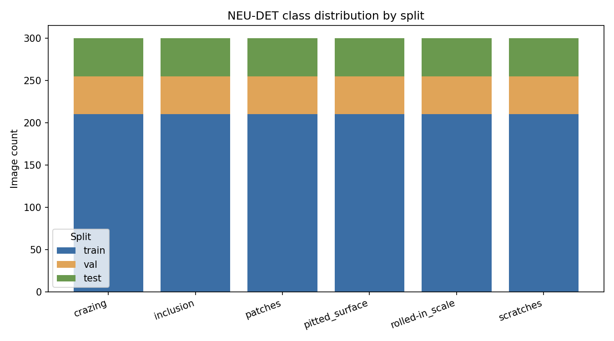

# NEU-DET Dataset Report

- **Dataset version:** 1.0.0
- **Generated:** 2026-09-21T06:36:24.497181+00:00

## Validation summary

- Files discovered: 1800
- Valid images (used downstream): 1800
- Invalid/excluded images: 0
- Total bounding boxes (valid images): 4189
- Boxes per image: min=1, max=9, mean=2.33

### Issues found

| Issue | Count |
|---|---|
| (none) | 0 |

## Class distribution (post-validation, post-split)

| Class | Train | Val | Test | Total |
|---|---|---|---|---|
| crazing | 210 | 45 | 45 | 300 |
| inclusion | 210 | 45 | 45 | 300 |
| patches | 210 | 45 | 45 | 300 |
| pitted_surface | 210 | 45 | 45 | 300 |
| rolled-in_scale | 210 | 45 | 45 | 300 |
| scratches | 210 | 45 | 45 | 300 |

