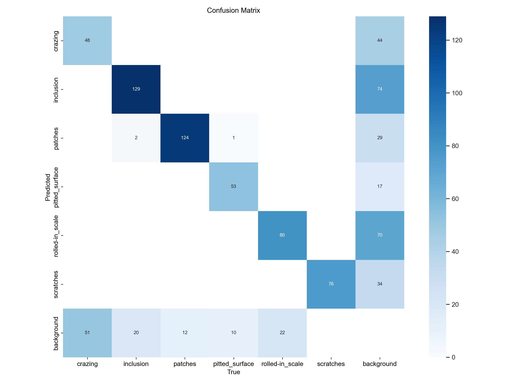
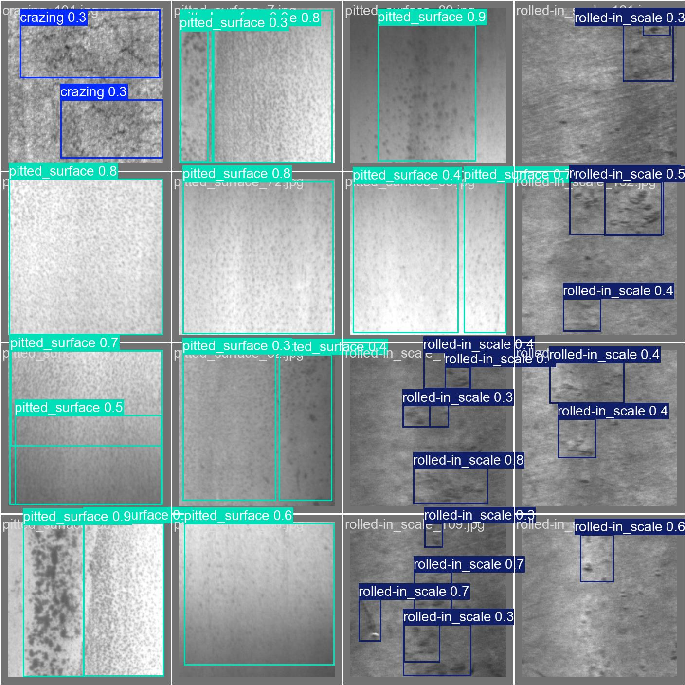

# Model Evaluation Report

- **Model version:** v1
- **Dataset version:** 1.0.0
- **Evaluated on:** held-out TEST split (never used for training or model selection)
- **Evaluated at:** 2026-09-21T19:01:34.841971+00:00

## Overall metrics

- mAP@50: **0.758**
- mAP@50-95: **0.415**
- Precision: **0.679**
- Recall: **0.745**

## Per-class metrics

| Class | Precision | Recall | mAP@50 | mAP@50-95 |
|---|---|---|---|---|
| crazing | 0.576 | 0.364 | 0.465 | 0.135 |
| inclusion | 0.676 | 0.828 | 0.835 | 0.446 |
| patches | 0.818 | 0.894 | 0.908 | 0.572 |
| pitted_surface | 0.785 | 0.799 | 0.854 | 0.535 |
| rolled-in_scale | 0.492 | 0.598 | 0.547 | 0.245 |
| scratches | 0.725 | 0.987 | 0.942 | 0.556 |

## Artifacts

